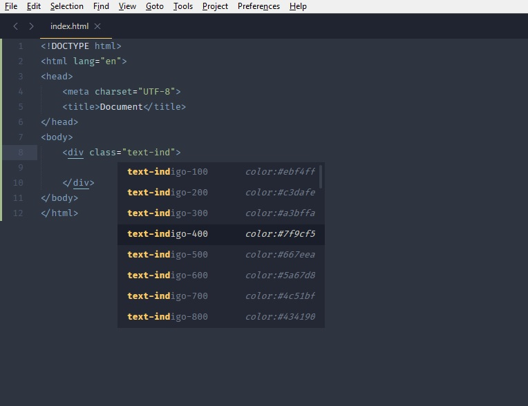

# TailwindCSS Autocomplete for Sublime Text 3

[TailwindCSS 1.2.0](https://tailwindcss.com/) (latest) Autocomplete plugin for SublimeText 3.

## Preview

## Installation
If you have Package Control installed in Sublime just press `ctrl+shift+p` (Windows, Linux)
or `cmd+shift+p` (OS X) to open the Command Palette. Start typing `install` to select `Package Control: Install Package`,
then search for `TailwindCSS Autocomplete` and select it. That's it.

## Contributions
PRs are welcomed :)

## LICENSE
MIT
